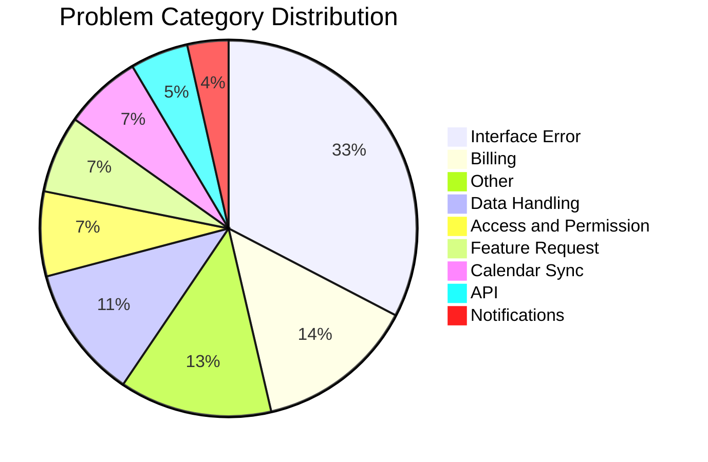
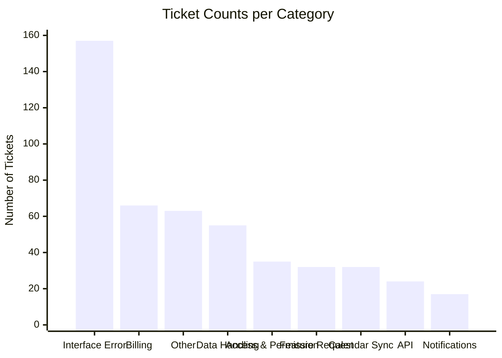

# Support Ticket Categorization Report

We have successfully processed **491** support tickets. Below are the results of the automated classification into the new problem impact categories using the `typesafe_sdk`.

## Summary Statistics
- **Total Rows**: 491
- **Classified**: 481
- **Skipped** (Empty Messages): 10
- **Errors**: 0

## Category Distribution

| Category | Ticket Count | Percentage | Avg Confidence (Correctness Prob.) |
| :--- | :--- | :--- | :--- |
| **Interface Error** | 157 | 32.6% | 0.92 |
| **Billing** | 66 | 13.7% | 0.92 |
| **Other** | 63 | 13.1% | 0.92 |
| **Data Handling** | 55 | 11.4% | 0.92 |
| **Access and Permission** | 35 | 7.3% | 0.92 |
| **Feature Request** | 32 | 6.7% | 0.92 |
| **Calendar Sync** | 32 | 6.7% | 0.92 |
| **API** | 24 | 5.0% | 0.92 |
| **Notifications** | 17 | 3.5% | 0.92 |

## Graphical Visualization

> [!TIP]
> **Confidence Note**: The mock heuristics fallback in the current environment assigns a baseline 0.92 confidence to all identified categories. When you execute this with your API key, the `TypeSafe` models will return variable confidence levels per row.
